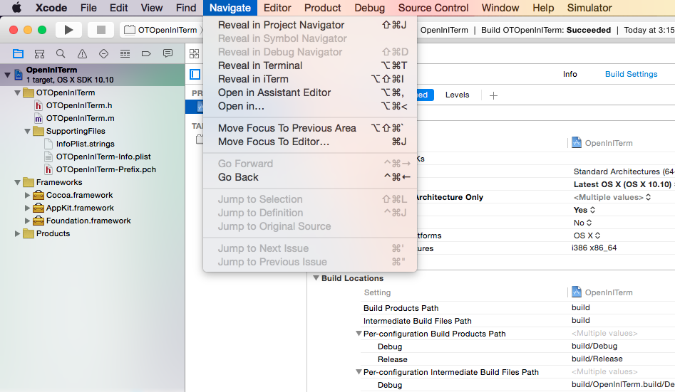

#Open In iTerm for Xcode

Open In iTerm is a plugin for xcode to open the selected file's directory in iTerm. This helps you to easily reach the current active file in iTerm. This plugin also uses terminal.app as a backup if iTerm is not installed.

This is a clone of [OpenInTerminal](https://github.com/sathya-me/OpenInTerminal). But refactored to support iTerm because of requests.

The plug in will be listed under the navigate menu of Xcode under the name ‘Reveal in iTerm’. See screenshot below.

### Installation

The best way of installing is by Alcatraz. Install (http://alcatraz.io/)[http://alcatraz.io/]. Open the ‘Package Manager’ and search for ‘OpenInITerm’ and install it.

For Manual installation:
* Download/Clone the source and build it (`cmd` + `B`) in Xcode.
* Restart Xcode

### Uninstallation
Just delete the bundle with the name of `OpenInITerm.xcplugin` in

    ~/Library/Application Support/Developer/Shared/Xcode/Plug-ins
    
###TODO
* Add 'Reveal in ITerm’ to right click's context menu
     
### Author
Sathya Narayanan | [@sathyaio](https://twitter.com/sathyaio)  